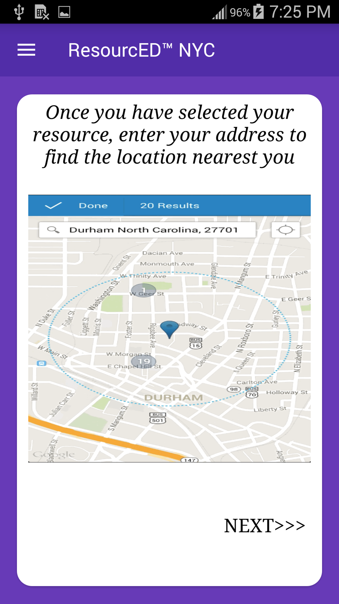

# ResourcED NYC App
  

Welcome to ResourcED NYC, the app that assists NYC's immigrants and mothers in locating local daycares in their area.
 

 

## User Guide
Once the app is installed, click on the ResourcED NYC icon
Then slide open the navigation drawer on the right and click on user profile
Enter your information in the fields provided and click save
A list of daycares in the area will then be shown on the main screen along with information on each location
 

## User Stories

##### (Maria) 
Maria’s daughter Ana is four years old, and Maria wants Ana to be prepared for kindergarten next year. 
Solution:
Maria installs  ResourcED™ NYC  on her phone. 
She enters her home address, and finds the nearest Early Childhood program to her home! 
Maria contacts the program, and schedules an appointment for Ana’s enrollment into the program!

##### (Lordes) 
Emily’s sister Lordes recently moved from Guatemala to Corona, Queens in July. Lordes speaks only Spanish, and wants to enroll her son Max by September.
Solution:
Emily installs  ResourcED™ NYC  on Lordes’s phone. 
Lordes follows the instructions in Spanish, and finds the nearest Early Childhood program to her home! 
Lordes contacts the program, and with Emily’s help schedules an appointment for Max’s enrollment into the program!

## The Journey So Far / How The App Works
-According to the NYC Department of Planning, over 3 million of New York City’s residents are foreign-born - and half of all New Yorkers speak at least one language other than English at home. 
-As of 2010 - over 771,000 New Yorkers are aged 5 or younger - that’s roughly 10% of the entire NYC population (!!!) - and that number is only expected to rise as we approach the end of this decade. 
-Limited access to information about Universal Pre-K is a problem for our city, because according to landmark observational studies like the HighScope Perry Preschool Study, children who participate in early childhood education are more likely to graduate high school, and less likely get arrested, or spend time in prison than those who do not. 
-Immigrant families have the added concern of a possible language barrier in gaining access to quality Preschool education, when searching for useful information. Although NYC.Gov has made efforts to share this infomation, many immigrant families might not know how best to identify their nearest location. 
## ResourcED™ NYC  fills the gap between resources and families, as the application:
-Is Mobile (can be used anywhere) 
-Is Easy to Use (just a few clicks will get a user what they need) 
-Is Singularly-Focused (no worry of being lost in the weeds of a misguided Google Search) 
-Utilizes approved, regularly updated, openly available NYC Data Sets 
-Takes advantage of a mobile device’s language settings (with instructions displayed in multiple languages) 

# What Can It Do?
## Feature 1 (Profile Making)
After the short tutorial on how to navigate throughout ResourcED NYC, the user can then enter their information and have it saved for future usage of the application
 

 

## Feature 2 (Daycare Locater)
Once the current address is entered and saved, the app will then generate a list of all local daycares as well as a map view to show the user how close each location is to them
 

 

## The Future
-Integrate more resources  (UPK, Child-care locations, After-School programs, etc) 
-Integration of a “Favorites List” - a collection of programs selected by the user for further investigation at a later date 
-Add more language translations (Russian, Brazilian Portuguese, etc.)
